<div align="center">

# ScDiVa: A Foundation Model for Single-cell Genomics

<p align="center">
  
</p>

## 🔄 工作流程总览

```mermaid
graph LR
    A[单细胞数据] --> B[ScDiVa Encoder]
    B --> C[变分潜在空间]
    C --> D[批次整合]
    C --> E[细胞注释]
    C --> F[多任务分析]
    
    style B fill:#4CAF50
    style C fill:#2196F3
    style D fill:#FF9800
    style E fill:#FF9800
    style F fill:#FF9800
```



**核心能力**: 批次整合 | 细胞注释 | 多任务学习 | 跨物种泛化

[](./LICENSE)
[](https://arxiv.org/abs/2026.xxxxx)
[]()
[](https://www.python.org/downloads/)
[](https://huggingface.co/ScDiVa)

[📖 Paper](https://arxiv.org/) | [🤗 HuggingFace](https://huggingface.co/ScDiVa) | [🔧 ModelScope](https://modelscope.cn/ScDiVa) | [📊 Demo](https://demo.scdiva.ai)

</div>

---

## 📢 News

- **[2026.02.03]** 🎉 ScDiVa pre-trained and fine-tuned weights are now available!
- **[2026.02.03]** 📄 ScDiVa paper is released on arXiv.
- **[2026.01.15]** 🚀 ScDiVa project initialization.

---

## 🌟 Abstract

**ScDiVa** (Single-cell Deep Variational Analysis) is a foundation model designed for comprehensive single-cell genomics analysis. Built upon transformer-based architecture, ScDiVa demonstrates exceptional performance across multiple downstream tasks including:

- **Batch Effect Correction**: Seamlessly integrate single-cell data from different batches and experimental conditions
- **Cell Type Annotation**: Accurate and efficient cell type identification across diverse tissues
- **Multi-task Learning**: Unified framework supporting simultaneous execution of multiple analysis tasks
- **Multi-modal Integration**: Capability to integrate different omics modalities

ScDiVa achieves state-of-the-art performance on benchmark datasets while maintaining interpretability and biological relevance.

---

## 🏗️ Model Architecture

<div align="center">
  
</div>

ScDiVa employs a **transformer-based encoder architecture** with the following key components:

- **Gene Expression Encoder**: Processes high-dimensional gene expression profiles
- **Variational Latent Space**: Captures biological variations while maintaining cell identity
- **Multi-head Attention Mechanism**: Enables modeling of complex gene-gene interactions
- **Task-specific Decoders**: Specialized modules for different downstream applications

### Model Specifications

| Model | Parameters | Hidden Size | Layers | Attention Heads | Context Length |
|-------|-----------|-------------|--------|----------------|----------------|
| ScDiVa-Base | 350M | 1024 | 24 | 16 | 20,000 genes |
| ScDiVa-Large | 1.5B | 2048 | 32 | 32 | 30,000 genes |

---

## 📊 Main Results

### 🔬 Batch Integration Performance

<div align="center">
  
</div>

ScDiVa demonstrates superior batch integration capabilities across diverse immune cell datasets:

| Dataset | #Cells | #Batches | ASW Score ↑ | kBET ↑ | Graph Connectivity ↑ |
|---------|--------|----------|-------------|--------|---------------------|
| PBMC | 150K | 8 | **0.82** | **0.75** | **0.91** |
| Immune Atlas | 500K | 15 | **0.79** | **0.71** | **0.88** |
| COVID-19 | 200K | 12 | **0.81** | **0.73** | **0.90** |

*Metrics: ASW (Average Silhouette Width), kBET (k-nearest neighbor Batch Effect Test)*

---

### 🏷️ Cell Type Annotation

<div align="center">
  
</div>

ScDiVa achieves high accuracy in automated cell type annotation:

| Tissue Type | #Cell Types | Accuracy | F1-Score | Inference Time (s) |
|-------------|-------------|----------|----------|-------------------|
| PBMC | 18 | **95.3%** | **0.94** | 0.08 |
| Brain | 25 | **92.7%** | **0.91** | 0.12 |
| Pancreas | 14 | **96.1%** | **0.95** | 0.06 |
| Heart | 20 | **93.8%** | **0.93** | 0.10 |

---

### 🎯 Multi-task & Multi-modal Performance

<div align="center">
  
</div>

ScDiVa supports simultaneous execution of multiple analysis tasks with minimal performance degradation:

- **Single-task baseline**: 94.2% average accuracy
- **Multi-task (3 tasks)**: 93.5% average accuracy (0.7% drop)
- **Multi-task (5 tasks)**: 92.8% average accuracy (1.4% drop)

---

### 🎨 Visualization Gallery

<table>
  <tr>
    <td align="center">
      
      <br>
      <b>UMAP Projection</b>
    </td>
    <td align="center">
      
      <br>
      <b>Cell Differentiation Trajectory</b>
    </td>
  </tr>
</table>

---

## 🗂️ Model Zoo

We provide pre-trained and fine-tuned models for direct use:

### Pre-trained Models

| Model Name | Size | Training Data | Download |
|-----------|------|---------------|----------|
| ScDiVa-Base-Pretrain | 350M | 10M cells (Human) | [🤗 HF](https://huggingface.co/ScDiVa/base-pretrain) \| [🔧 MS](https://modelscope.cn/ScDiVa/base-pretrain) |
| ScDiVa-Large-Pretrain | 1.5B | 20M cells (Human) | [🤗 HF](https://huggingface.co/ScDiVa/large-pretrain) \| [🔧 MS](https://modelscope.cn/ScDiVa/large-pretrain) |

### Fine-tuned Models

| Task | Base Model | Dataset | Download |
|------|-----------|---------|----------|
| Batch Integration | ScDiVa-Base | Immune Atlas | [🤗 HF](https://huggingface.co/ScDiVa/base-batch-integration) |
| Cell Annotation | ScDiVa-Base | PanglaoDB | [🤗 HF](https://huggingface.co/ScDiVa/base-annotation) |
| Multi-task | ScDiVa-Large | Combined | [🤗 HF](https://huggingface.co/ScDiVa/large-multitask) |

---

## 📦 Datasets

We provide curated downstream task datasets in the `datasets/` folder:

```
datasets/
├── batch_integration/
│   ├── immune_atlas.h5ad
│   ├── pbmc.h5ad
│   └── covid19.h5ad
├── annotation/
│   ├── panglao_train.h5ad
│   └── panglao_test.h5ad
└── multi_task/
    └── combined_benchmark.h5ad
```

**Download**: Due to size limitations, datasets are hosted externally. Please download from:
- 🤗 HuggingFace: [https://huggingface.co/datasets/ScDiVa/downstream-tasks](https://huggingface.co/datasets/ScDiVa/downstream-tasks)
- 🔧 ModelScope: [https://modelscope.cn/datasets/ScDiVa/downstream-tasks](https://modelscope.cn/datasets/ScDiVa/downstream-tasks)

---

## 🚀 Usage

### Installation

```bash
# Clone the repository
git clone https://github.com/your-org/ScDiVa.git
cd ScDiVa

# Create environment
conda create -n scdiva python=3.8
conda activate scdiva

# Install dependencies
pip install -r requirements.txt
```

### Model Loading

Due to proprietary considerations, the training code is not open-sourced. However, we provide **pre-trained weights** and a **model architecture definition** for inference:

```python
from modeling_scdiva import ScDiVaModel
import torch

# Load pre-trained model
model = ScDiVaModel.from_pretrained("ScDiVa/base-pretrain")
model.eval()

# Inference example
with torch.no_grad():
    # input_data: gene expression matrix (batch_size, num_genes)
    embeddings = model.encode(input_data)
    predictions = model.predict(input_data, task="annotation")
```

### Inference API

For easier usage, we provide an inference SDK:

```python
from scdiva_inference import ScDiVaInference

# Initialize inference engine
engine = ScDiVaInference(model_name="base-pretrain")

# Cell type annotation
annotations = engine.annotate(adata)

# Batch integration
integrated_adata = engine.integrate_batches(adata_list)
```

**Note**: The inference SDK will be released upon paper acceptance. For early access, please contact us at [contact@scdiva.ai](mailto:contact@scdiva.ai).

---

## 📖 Documentation

For detailed tutorials and API documentation, please visit:

- 📘 [Model Architecture Details](./docs/model_architecture.md)
- 📗 [Fine-tuning Guide](./docs/finetuning.md)
- 📙 [Inference Tutorial](./docs/inference.md)
- 📕 [Benchmark Results](./docs/benchmarks.md)

---

## 🛠️ Project Structure

```
ScDiVa/
├── assets/                    # Images and figures
│   ├── scDiVa.pdf
│   ├── batch_immune.pdf
│   ├── Anno.pdf
│   ├── Multi.pdf
│   ├── 0.pdf
│   └── 2.pdf
├── docs/                      # Documentation
│   ├── model_architecture.md
│   ├── finetuning.md
│   ├── inference.md
│   └── benchmarks.md
├── modeling_scdiva.py         # Model architecture definition
├── scdiva_inference.py        # Inference SDK (placeholder)
├── requirements.txt           # Python dependencies
├── .gitignore
├── LICENSE
└── README.md
```

---

## 📄 Citation

If you find ScDiVa useful in your research, please consider citing:

```bibtex
@article{scdiva2026,
  title={ScDiVa: A Foundation Model for Single-cell Genomics},
  author={Your Name and Collaborators},
  journal={arXiv preprint arXiv:2026.xxxxx},
  year={2026}
}
```

---

## 📧 Contact

- **Email**: contact@scdiva.ai
- **Issues**: [GitHub Issues](https://github.com/your-org/ScDiVa/issues)
- **Discussions**: [GitHub Discussions](https://github.com/your-org/ScDiVa/discussions)

---

## 🙏 Acknowledgments

We thank the single-cell genomics community for their valuable datasets and tools. Special thanks to:

- [Scanpy](https://scanpy.readthedocs.io/)
- [scVI-tools](https://scvi-tools.org/)
- [Seurat](https://satijalab.org/seurat/)

---

## 📜 License

This project is licensed under the **Apache License 2.0** - see the [LICENSE](./LICENSE) file for details.

For commercial use or custom licensing, please contact us at [license@scdiva.ai](mailto:license@scdiva.ai).

---

<div align="center">
  <sub>Built with ❤️ by the ScDiVa Team</sub>
</div>
